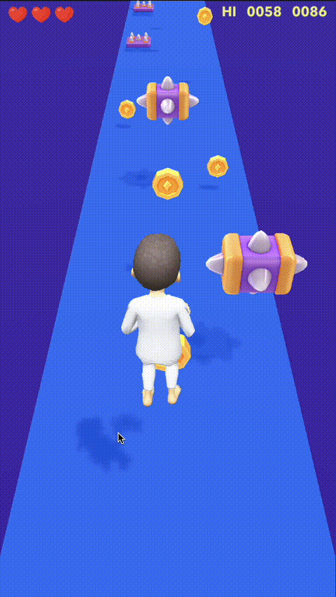

# Endless Runner Lens

[English](README.md) | [Українська](README.ua.md)


Проста гра жанру **нескінченний раннер**, створена у **Lens Studio** для Snapchat.

Біжіть уперед, уникайте перешкод, збирайте нагороди та намагайтеся встановити новий рекорд.

## Вимоги

Щоб відкрити, редагувати або запустити проєкт локально, потрібно:

- **Lens Studio** (рекомендовано останню версію)
- акаунт Snapchat (необов’язково, для тестування на мобільному)
- Windows або macOS

## Налаштування

Цей проєкт використовує **Git LFS** для великих файлів ресурсів.

Рекомендується клонувати репозиторій замість завантаження ZIP-архіву.

```bash
git clone https://github.com/albruevich/Runner.git
cd Runner
git lfs install
git lfs pull
```

Завантаження проєкту як ZIP може призвести до відсутніх або пошкоджених посилань на ресурси у Lens Studio.

## Режим перегляду

Для найкращого перегляду гри у Lens Studio використовуйте:

- **World** mode

Інші режими перегляду (наприклад Idle / Face) можуть змінювати кадрування камери та більше призначені для AR-тестування, а не для ігрового процесу.

## Демонстрація



## Керування

### Комп’ютер / Редактор

- **Стрілка вліво** — рух ліворуч  
- **Стрілка вправо** — рух праворуч  
- **Стрілка вгору** або **Space** — стрибок  
- **Перетягування мишкою ліворуч / праворуч** — рух  
- **Перетягування мишкою вгору** — стрибок  
- **Будь-який тап / клік / ввід** на стартовому екрані — почати гру

### Мобільний пристрій

- **Свайп ліворуч** — рух ліворуч  
- **Свайп праворуч** — рух праворуч  
- **Свайп вгору** — стрибок  
- **Тап / свайп** на стартовому екрані — почати гру

## Створено за допомогою

- Lens Studio
- JavaScript

## Особливості

- Нескінченний раннер із 3 доріжками
- Перешкоди, стрибки та нагороди
- Поступове зростання швидкості гри
- Збереження рекорду
- Керування свайпами та клавіатурою
- Пулінг об’єктів
- UI-ефекти та звуковий супровід
- Анімації персонажа
- Швидкий перезапуск без виходу з лінзи